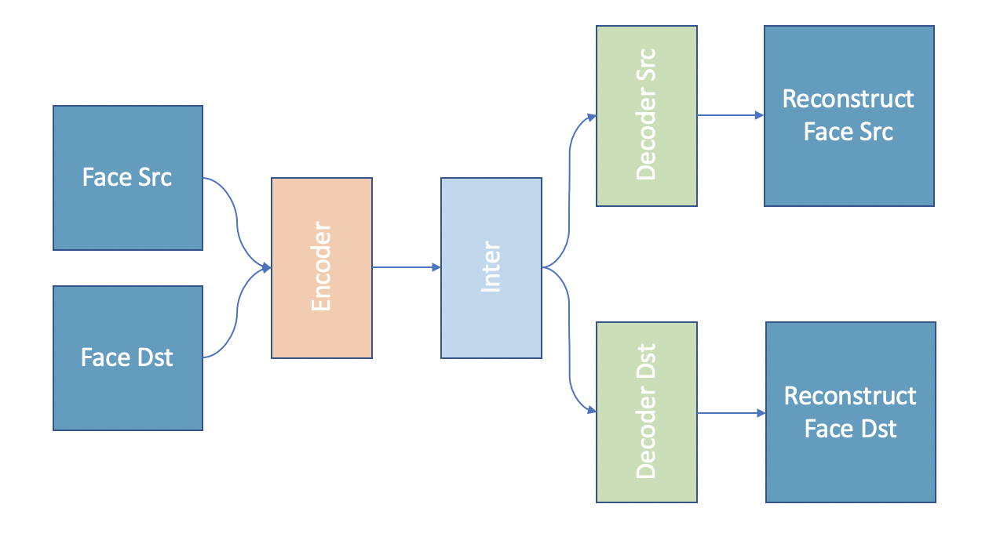
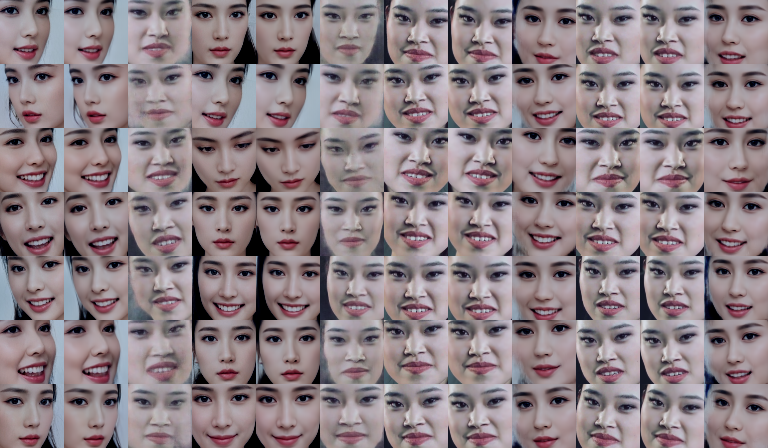

# Deep Fakes Lightning

This project is a study project about deep fakes technology. In this project, it used the original deep fakes architecture, and trained the model with Pytorch lightning. The aim is to make an open-source project which is similar to DeepFaceLab.

## Deep Fakes

Deep Fakes is kind of a technology using for face-swapping. These years, with the emerging of AI and GAN, the Deep Fakes technology become maturer and maturer. We can easily find fantastic face-swapping videos on Youtube. And most of them are made from DeepFaceLab

## Why DeepFaceLab

DeepFaceLab is the most well-known face-swapping open-source library. It's easy to use and can fully use the GPU power on Windows system. With its power, many ameture can make a master-piece deepfakes video. However, its code is highily abstract and encapsulated, make you uneasy to make this codebase scalable. So this project is aim to build pipeline of face-swapping, and make it scalable to add any other open-source model.

## Why Pytorch Lightning

Since Pytorch is more and more popular for AI developers, Pytorch Lightning is kind of library totally based on Pytorch. It can help you decouple your Pytorch research code and engineering code, makes your code clean and speeds up your development.

## Model Architecture

This project follows the deep fakes architecture, uses a shared weight encoder, and trains seperated decoder for both src and dst faces. Finally, it uses the dst face as input to the src decoder to do the face-swapping.

## Training Result

In each batch is: src/dst face, reconstructed face, swapped face.

MSELoss with src/dst faces and reconstructed faces

## To Do

### data

1. data preprocessing
2. face alignment
3. data augmentation

### model

1. add landmark loss for more accurate expression transformation.
2. add discriminator 

### production

1. add merging pipeline
2. add colab notebooks
